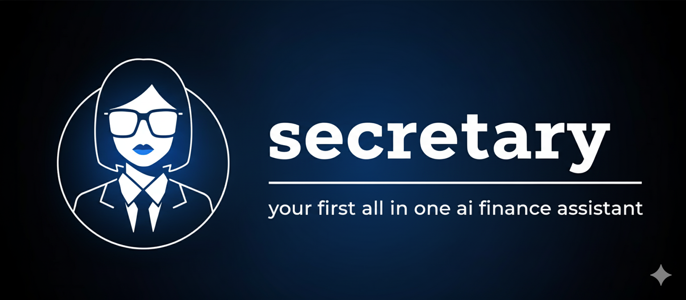

<div align="center">
  
  
  
  ### AI-Powered Personal Finance Dashboard
  
  A comprehensive financial management platform featuring real-time transaction tracking, AI-driven insights, budget planning, investment and vacation advising, and intelligent financial advisory powered by Google Gemini AI and Capital One's Nessie API.
    
  Built by @arush-n, @RishikKolpekwar, @nikhilsaravanan, and @AmoghThodati2
  
  [](https://reactjs.org/)
  [](https://flask.palletsprojects.com/)
  [](https://tailwindcss.com/)
  [](https://ai.google.dev/)
  
</div>

---

## 🚀 Features

- **📊 Real-Time Dashboard** - Complete overview of net worth, budgets, assets, and liabilities
- **🤖 AI Financial Advisor** - Personalized insights and recommendations from Google Gemini
- **💳 Transaction Management** - Automatic categorization and tracking with AI-powered analysis
- **📅 Budget Calendar** - Visual budget planning and recurring expense tracking
- **💰 Investment Tracking** - Monitor portfolio performance and asset allocation
- **🏖️ Vacation Planner** - Budget and plan trips with financial forecasting
- **⚙️ Smart Settings** - Customizable categories, tags, and preferences with sync

---

## 📁 Project Structure

```
hacktx-secretary/
├── backend/
│   ├── app.py                 # Flask API server
│   ├── stock_advisor.py       # Stock market integration
│   ├── requirements.txt       # Python dependencies
│   └── .env                   # API keys (create this)
│
└── frontend/
    ├── src/
    │   ├── components/        # React components
    │   │   ├── DashboardView.jsx
    │   │   ├── Transactions.jsx
    │   │   ├── BudgetCalendar.jsx
    │   │   ├── Investments.jsx
    │   │   ├── Chat.jsx
    │   │   ├── SettingsPage.jsx
    │   │   └── ...
    │   ├── assets/            # Images and static files
    │   ├── App.jsx            # Main app component
    │   └── index.css          # Global styles
    │
    ├── package.json           # npm dependencies
    ├── tailwind.config.js     # Tailwind configuration
    └── vite.config.js         # Vite build config
```

---

## 🛠️ Setup & Installation

### Prerequisites

- **Node.js** (v16+)
- **Python** (v3.8+)
- **npm** or **yarn**

### Backend Setup

```bash
# Navigate to backend directory
cd backend

# Create virtual environment
python -m venv venv
source venv/bin/activate  # Windows: venv\Scripts\activate

# Install dependencies
pip install -r requirements.txt

# Create .env file with API keys
echo "GEMINI_API_KEY=your_gemini_api_key_here" > .env
echo "NESSIE_API_KEY=your_nessie_api_key_here" >> .env

# Run Flask server
python app.py
```

**Backend runs on:** `http://localhost:5001`

### Frontend Setup

```bash
# Navigate to frontend directory
cd frontend

# Install dependencies
npm install

# Start development server
npm run dev
```

**Frontend runs on:** `http://localhost:3000` (or next available port)

---

## 🔑 API Keys

| Service | Link | Purpose |
|---------|------|---------|
| **Google Gemini API** | [Get API Key](https://makersuite.google.com/app/apikey) | AI-powered transaction categorization and financial advice |
| **Capital One Nessie API** | [Developer Portal](https://developer.capitalone.com/) | Mock banking data for transactions and accounts |

Add your API keys to `backend/.env`:

```env
GEMINI_API_KEY=your_gemini_api_key_here
NESSIE_API_KEY=your_nessie_api_key_here
```

---

## 💻 Tech Stack

| Layer | Technologies |
|-------|-------------|
| **Frontend** | React, Vite, Tailwind CSS, Lucide Icons |
| **Backend** | Python, Flask, Flask-CORS |
| **AI/ML** | Google Gemini 2.5 Flash |
| **APIs** | Capital One Nessie API |
| **State Management** | React Hooks, localStorage |
| **Styling** | Tailwind CSS, Custom Dark Theme |

---

## 📝 License

Built for HackTX 2025. All rights reserved.

---

<div align="center">
  <p>Made with ❤️ by the Secretary Team</p>
  <p>
    <a href="https://github.com/arush-n/secretary">⭐ Star us on GitHub</a>
  </p>
</div>
